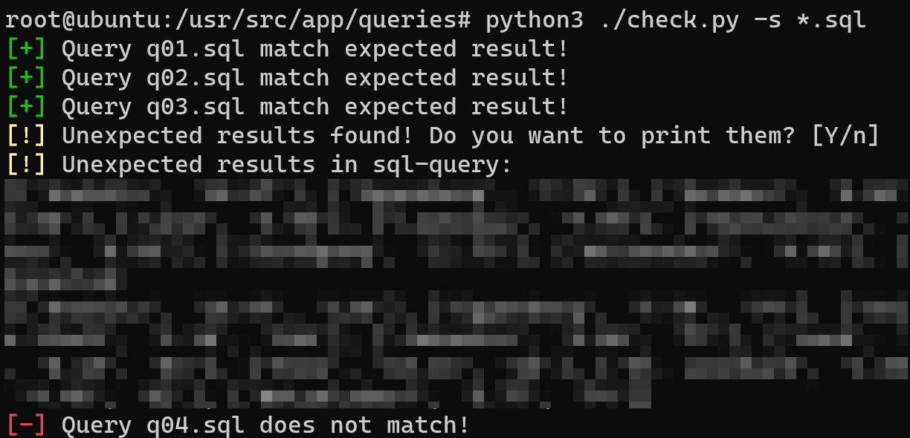

# DM-sql-checker
Checks given queries against reference files

## Using Docker
```bash
chr0x6eos@wsl:~$ make all
  docker build . -t dm-checker
  [+] Building 0.3s (10/10) FINISHED
  [...]
  docker run --rm -it dm-checker bash
root@e7f73e9f2823:/opt/data# ./check.py -h
usage: check.py [-h] [-H HOST] [-P PORT] [-d DB] [-u USER] [-p PASSWORD] [-v] -s SQL [SQL ...]

DM Query comparer by Simon Possegger

optional arguments:
  -h, --help            show this help message and exit
  -H HOST, --host HOST  Host the datbase is running on (Default: db)
  -P PORT, --port PORT  Port the database is running on (Default: 5432)
  -d DB, --db DB        Database to connect to (Default: dm)
  -u USER, --user USER  Username for connecting to the database (Default: postgres)
  -p PASSWORD, --password PASSWORD
                        Password for connecting to the database (Default: postgres)
  -v, --verbose         Show verbose
  -s SQL [SQL ...], --sql SQL [SQL ...]
                        Select sql to run (Naming convention: q[0-8].sql)
root@e7f73e9f2823:/opt/data#
```

## Usage
```bash
chr0x6eos@wsl:~$ python3 check.py -h
usage: check.py [-h] [-H HOST] [-P PORT] [-d DB] [-u USER] [-p PASSWORD] [-v] -s SQL [SQL ...]

DM Query comparer by Simon Possegger

optional arguments:
  -h, --help            show this help message and exit
  -H HOST, --host HOST  Host the datbase is running on (Default: db)
  -P PORT, --port PORT  Port the database is running on (Default: 5432)
  -d DB, --db DB        Database to connect to (Default: dm)
  -u USER, --user USER  Username for connecting to the database (Default: postgres)
  -p PASSWORD, --password PASSWORD
                        Password for connecting to the database (Default: postgres)
  -v, --verbose         Show verbose
  -s SQL [SQL ...], --sql SQL [SQL ...]
                        Select sql to run
```

### Example output

